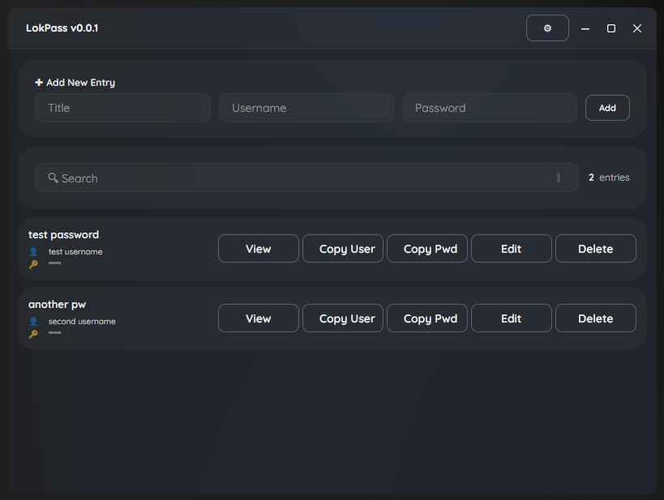

# LokPass – cross platform password manager

---

## Project Goals

The goal of LokPass is to create an extensible application that:

- Runs entirely offline – no cloud or external services (syncing solutions may be added in the future)
- Stores passwords using modern cryptographic standards
- Is modular and flexible in how users interact with it (UI, CLI, API)
- Has an own password generator
- Automatic Backups
- Has portable builds with no installations needed
- Can import from other password managers:
  - KeePass-Files (.kdbx)
  - ...

## Frontend

Starting:

- Desktop UI (Avalonia)

To be defined – possible options include:

- Command Line Interface (CLI)
- Web-based or mobile clients (future consideration)

---

## Roadmap

### v0.0.1

- [x] add password
- [x] Basic password storage in memory
- [x] Basic UI
- [x] show password in UI
- [x] copy password / username to clipboard
- [x] delete password / username

### v0.0.2

- [x] edit password / username
- [ ] save passwords to file
- [ ] load passwords from file

---

## License

This project is licensed under the **MIT License**.
